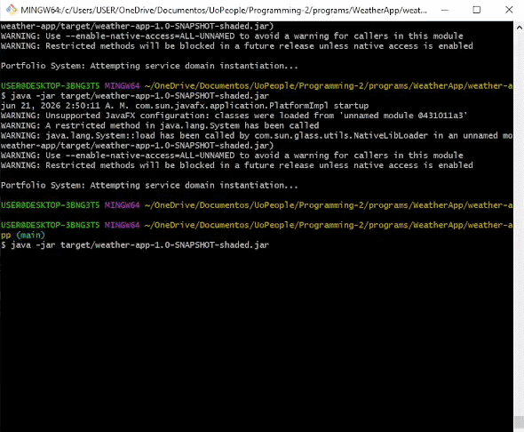
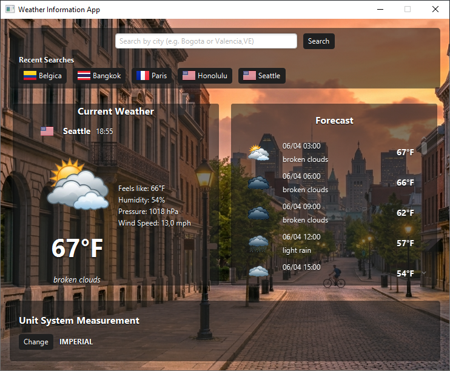
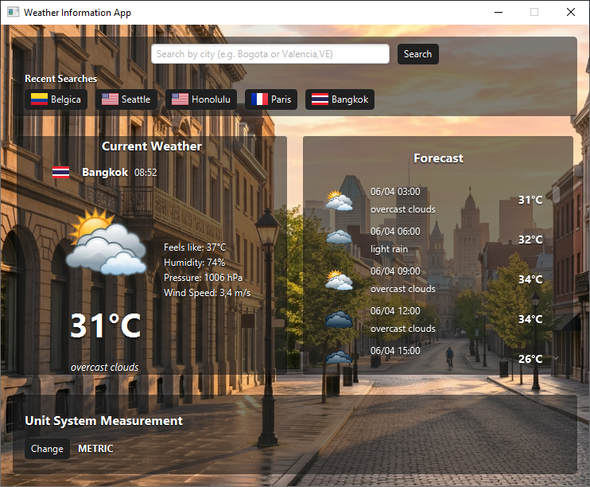
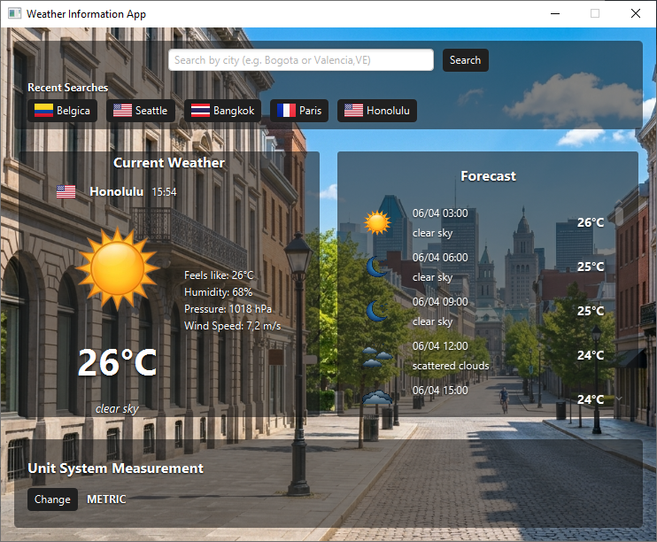
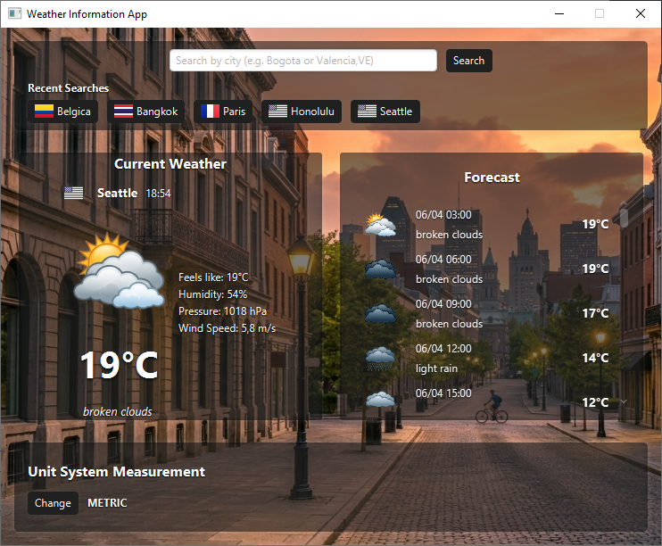

# Weather Desktop Application (JavaFX + OpenWeatherMap)

A modern desktop weather application built with JavaFX 25 that provides real-time weather data and multi-day forecasts using the OpenWeatherMap API.
Designed with clean architecture principles and performance-focused features such as caching and asynchronous data handling.

### 📌 Table of Contents

- [Overview](#overview)
- [Key Features](#key-features)
- [Application Preview](#application-preview)
- [How to Use](#how-to-use)
- [Architecture & Design](#architecture--design)
- [Technology Stack](#technology-stack)
- [Build & Run](#build--run)
- [Configuration & API Key](#configuration--api-key)
- [Releases](#releases)

## Overview

This application provides real-time weather information for cities worldwide, combining a responsive JavaFX interface with a robust backend architecture. It was designed as an engineering-focused project to demonstrate:

* Clean separation of concerns
* Asynchronous UI responsiveness
* External API integration
* Efficient local caching strategies
* Scalable data modeling with DTOs

## Key Features

* City search with ISO-2 country support (e.g., Valencia,ES)
* Real-time weather conditions
* 5-day forecast with 3-hour intervals
* In-memory caching system (10-minute TTL)
* Search history (last 5 queries, clickable)
* Fully asynchronous API requests (non-blocking UI)
* Dynamic unit conversion (Metric / Imperial) without API calls
* Clean MVC-inspired layered architecture
* Secure API key storage (local config file)

## Application Preview

<p align="center"> 
       
       
</p> 
<p align="center"> 
       
       
       
       
</p>

## How to Use

### Searching for a City

Enter a city name in the search bar:

```text
Madrid
```

For more precise results (recommended):

```text
Valencia,ES
Valencia,VE
```

The application supports ISO-2 country codes to avoid ambiguity between cities with identical names.

### Search History

* The last 5 searches are stored locally.
* Clicking a previous search instantly reloads results.
* Cached results are reused if they are less than 10 minutes old.
* If cache expires, data is automatically refreshed from the API.

### Interface Layout

The application follows a single-screen structured layout:

* Top: Search bar  
* Middle: Search history  
* Main section:
  * Current weather panel
  * 5-day forecast panel (3-hour intervals)

Both panels are displayed side-by-side for quick comparison.

### Unit System

* Toggle between Metric and Imperial units
* Changes are applied instantly
* No additional API requests are triggered
* Values are recalculated in real time from cached data

## Architecture & Design

The application was designed around several software engineering principles:

* **Layered Separation (MVC-inspired):** UI layout handling (FXML/CSS) is completely separated from backend queries. Visual nodes have no direct access to remote servers.
* **Asynchronous Task Execution:** All heavy API requests run on background threads using `javafx.concurrent.Task`, ensuring a responsive UI and preventing blocking operations.
* **State Management via JavaFX Properties:** Controllers communicate state parameters (like switching between Celsius and Fahrenheit units) via central observable properties (`ObjectProperty<UnitSystem>`).
* **LRU Cache with time-based eviction:** Uses a local `LinkedHashMap` bound to a 10-minute validity threshold to reduce redundant API queries and fuel the interactive search history panel.
* **DTO Separation:** API payloads are first mapped into Data Transfer Objects (`CurrentWeatherDTO`, `ForecastDTO`) and then converted into domain models. This isolates the application from changes in the external API structure.

## Technology Stack

This application is built with a Java-based desktop stack designed for responsiveness, clean architecture, and efficient API-driven data handling. Each technology was selected to support a modular, scalable, and performant application structure.

| Layer / Tool   | Role in System   | Why it matters                                            |
| -------------- | ---------------- | --------------------------------------------------------- |
| Java 25        | Core runtime     | Ensures performance and modern language features          |
| JavaFX 25      | UI layer         | Enables responsive desktop interface                      |
| Maven          | Build system     | Manages dependencies and packaging                        |
| OpenWeatherMap | Data source      | Provides real-time weather data                           |
| Gson           | JSON parser      | Converts API responses into structured objects            |
| HttpClient     | Networking layer | Handles HTTP requests to external API                     |
| FXML / CSS     | UI design layer  | Separates structure and styling for clean UI architecture |

## Build & Run

### Requirements
* **Java 25+**
* **Maven 3.9+**

### 1. Compile the Project
To build the application:
```bash
mvn clean package
```

### 2. Run the Program

* **Via Maven CLI (Development Profile):**
  
  ```bash
  mvn exec:java
  ```
  or:

  ```bash
  mvn javafx:run
  ```
* **Via Standalone Binary Execution:**
  
  ```bash
  java -jar target/weather-app-1.0-SNAPSHOT-shaded.jar
  ```

## Configuration & API Key

The application avoids hardcoded API credentials by requesting the user's OpenWeatherMap key during the first execution.

1. On first launch, a graphical dialog prompts for an OpenWeatherMap API key.
2. The application validates the key before saving it locally in a `config.properties` file.
3. Invalid credentials prevent the application from starting.
4. The file is excluded from version control via `.gitignore`.

**File Location Behavior**

The `config.properties` file is created and loaded from the current working directory.

This means:

* If the application is started from a terminal in C:\, the file will be created there.
* If started from C:\Documents\WeatherApp, the file will be created in that directory.
* If executed via a JAR (double-click or command), the file will be created in the directory from which the JAR is launched.

In short: the configuration file is always stored relative to where the application is executed.

**Manual Setup (optional):** 

Alternatively, you can manually create the file:

```properties
api.key=YOUR_VALID_OPENWEATHERMAP_API_KEY_HERE
```

Place it in the same directory where the application is executed.

## Releases

Standalone builds are available in the GitHub Releases section.

👉 **[View Latest Release](../../releases)**

## Summary

This project demonstrates a production-style JavaFX application focused on:

* Clean architecture principles
* Reactive UI design
* Efficient API consumption
* Local caching strategies
* Scalable data modeling

Built as an engineering-focused exercise in modern desktop application development.