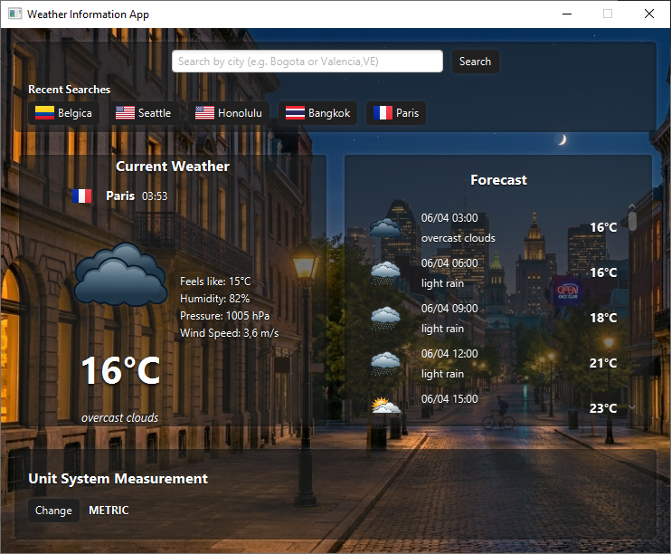

# Weather Information App

## Overview

Weather Information App is a desktop application developed in Java using JavaFX and the OpenWeatherMap API. The application retrieves real-time weather conditions and short-term forecasts for any supported location and presents the information through a graphical user interface.

The project was designed following a layered architecture that separates user interface components, application state, business logic, API communication, and domain models. The application also demonstrates the use of JavaFX FXML views, CSS styling, asynchronous tasks, observable properties, HTTP communication, JSON deserialization, and in-memory caching.


---

## Features

### Weather Search

Users can search for weather information using:

* City name
* City name + ISO country code

Examples:

```text
Bogota
London,GB
Valencia,VE
Madrid,ES
```

### Current Weather Information

The application displays:

* Current temperature
* Feels-like temperature
* Humidity
* Atmospheric pressure
* Wind speed
* Weather description
* Local time at the selected location
* Country flag (when available)

### Forecast Information

The forecast panel displays future weather predictions provided by OpenWeatherMap, including:

* Forecast date and time
* Weather condition
* Temperature
* Weather icon

### Unit System Switching

Users can dynamically switch between:

* Metric System (°C, m/s)
* Imperial System (°F, mph)

All weather information is internally stored in metric units and converted only during rendering.

### Search History

The application maintains a history of recent searches.

History entries:

* Can be clicked to repeat a search
* Are stored in memory during execution
* Serve as a lightweight API cache

### Dynamic Visual Resources

The application includes:

* Dynamic backgrounds based on local time
* Custom weather icon sprite sheet
* Country flags
* Loading animations

---

# Technology Stack

| Technology         | Purpose                         |
| ------------------ | ------------------------------- |
| Java 25            | Programming language            |
| JavaFX 25          | GUI framework                   |
| Maven              | Build and dependency management |
| OpenWeatherMap API | Weather data provider           |
| Gson               | JSON deserialization            |
| Java HttpClient    | API communication               |
| CSS                | User interface styling          |
| FXML               | Declarative UI definition       |

---

# Project Architecture

The application follows an MVC-inspired layered architecture.

```text
Presentation Layer
│
├── FXML Views
├── JavaFX Controllers
└── CSS Stylesheets

Application Layer
│
├── AppState
└── UnitSystem

Service Layer
│
└── WeatherService

Domain Layer
│
├── WeatherReport
├── WeatherData
└── ForecastEntry

Integration Layer
│
├── CurrentWeatherDTO
└── ForecastDTO
```

---

# Project Structure

```text
weather-app
├───src
│   └───main
│       ├───java
│       │   └───com.berbin.weatherapp
│       │       ├───controllers
│       │       ├───models
│       │       ├───services
│       │       │   └───dto
│       │       ├───state
│       │       └───utils
|       |       └───WeatherApp.java
│       └───resources
│           └───com.berbin.weatherapp
│               ├───fxml
│               │   └───components
│               ├───images
│               │   ├───backgrounds
│               │   └───icons
│               │       └───flags
│               └───styles
└───target
```

---

# Component Responsibilities

## WeatherApp

Application entry point.

Responsibilities:

* Launch JavaFX
* Load main.fxml
* Create application services
* Create application state
* Inject dependencies into MainController

---

## MainController

Acts as the application's orchestrator.

Responsibilities:

* Receive search requests
* Coordinate weather retrieval
* Manage loading state
* Render weather information
* Refresh UI when units change
* Update search history
* Apply dynamic backgrounds

This is the only controller that directly communicates with the service layer.

---

## SearchBarController

Reusable search component.

Responsibilities:

* Capture user input
* Validate empty searches
* Notify parent controller through callback

The component has no knowledge of weather services.

---

## CurrentWeatherController

Responsible only for rendering current weather information.

Responsibilities:

* Display location information
* Display weather conditions
* Display weather details
* Display weather icons
* Display country flags

No business logic is performed here.

---

## ForecastController

Responsible for rendering forecast entries.

Responsibilities:

* Create forecast cards
* Manage empty states
* Populate forecast container

---

## HistoryBarController

Responsible for displaying cached searches.

Responsibilities:

* Render search history
* Create history items dynamically
* Trigger repeated searches

---

# State Management

The project uses a centralized state object:

```java
AppState
```

Currently the state stores:

```java
UnitSystem
```

using:

```java
ObjectProperty<UnitSystem>
```

This allows controllers to react automatically when the selected measurement system changes.

Future application-wide settings should be added to AppState rather than stored inside individual controllers.

---

# Weather Service

The WeatherService class encapsulates all communication with OpenWeatherMap.

Responsibilities:

* Execute HTTP requests
* Deserialize JSON responses
* Convert DTOs into domain models
* Maintain search history cache
* Validate cache expiration

---

## API Endpoints

Current weather:

```text
/weather
```

Forecast:

```text
/forecast
```

Both requests are executed using Java's HttpClient.

---

## Caching Strategy

The service maintains an in-memory cache using:

```java
LinkedHashMap<String, WeatherReport>
```

Characteristics:

* Maximum 5 entries
* Access-order enabled
* Automatic eviction of oldest entries
* Cache validity: 10 minutes

Benefits:

* Reduces API requests
* Provides search history
* Improves responsiveness

---

# Domain Models

## WeatherReport

Represents a complete weather query.

Contains:

* City
* Country code
* Timezone offset
* Current weather
* Forecast entries
* Retrieval timestamp

---

## WeatherData

Represents current weather conditions.

Contains:

* Temperature
* Feels-like temperature
* Humidity
* Pressure
* Wind speed
* Description
* Weather icon code

---

## ForecastEntry

Represents a forecast prediction.

Contains:

* Date and time
* Temperature
* Description
* Weather icon code

---

# DTO Layer

The project separates API structures from domain models.

DTO classes:

```java
CurrentWeatherDTO
ForecastDTO
```

Responsibilities:

* Match OpenWeatherMap JSON structure
* Deserialize responses using Gson
* Isolate external API changes

This prevents API-specific structures from leaking into the business layer.

---

# Asynchronous Execution

Weather retrieval is performed using:

```java
javafx.concurrent.Task
```

This prevents blocking the JavaFX Application Thread.

Workflow:

```text
User Search
      ↓
Show Loading Overlay
      ↓
Background API Request
      ↓
Map Response
      ↓
Update UI
      ↓
Hide Overlay
```

---

# Visual Resources

## Weather Icons

The application uses a custom sprite sheet containing weather icons mapped to OpenWeatherMap icon codes.

Examples:

```text
01d
01n
02d
02n
...
```

The correct icon is extracted dynamically at runtime.

---

## Background Images

Backgrounds are selected according to local time:

| Time          | Background |
| ------------- | ---------- |
| 06:00 - 11:59 | Morning    |
| 12:00 - 16:59 | Day        |
| 17:00 - 18:59 | Sunset     |
| 19:00 - 05:59 | Night      |

---

# Building the Project

## Requirements

* JDK 25
* Maven 3.9+

Verify installation:

```bash
java -version
mvn -version
```

---

## Compile

```bash
mvn clean compile
```

This command:

* Downloads dependencies
* Compiles source code
* Validates project structure

---

## Run

Using Exec Maven Plugin:

```bash
mvn exec:java
```

Alternatively:

```bash
mvn javafx:run
```

---

# Configuration

The OpenWeatherMap API key is currently injected when creating the WeatherService instance:

```java
WeatherService service =
    new WeatherService("YOUR_API_KEY");
```

For production systems it is recommended to:

* Move the key to environment variables
* Use a configuration file
* Avoid committing secrets to source control
---
